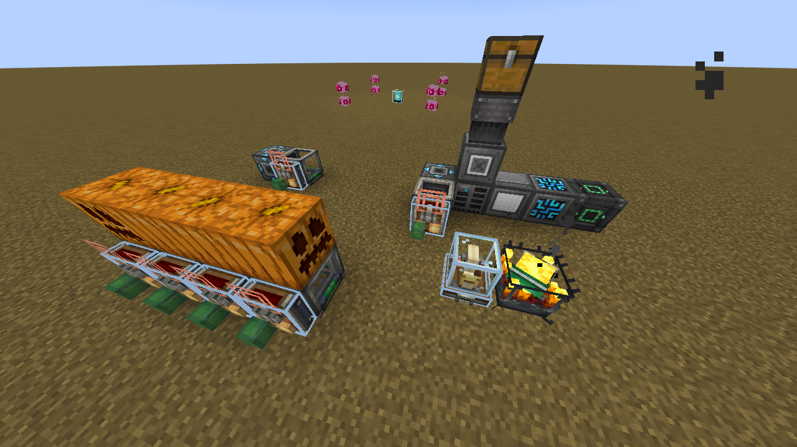

# Create: Collection Bundles

  

An experimental mod adding feature for `Create` logistic system to extract items from several types of blocks

# Current Contents

-   Carving pumpkins by extracting its seed
-   `Refined Storage` compat: extracting items inside network through:
    -   controller blocks
    -   network transmitter/receiver blocks
    -   **NOTE:** due to some undefined behaviors, _inserting_ items into these blocks are not supported, only _extracting_ allowed

# Future Plans

-   [ ] supporting `AE2` network
-   [ ] custom registration API via `KubeJS`
-   [ ] porting to Fabric and other versions
